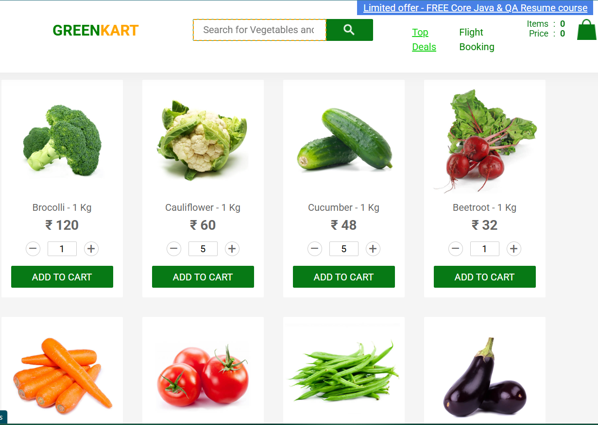
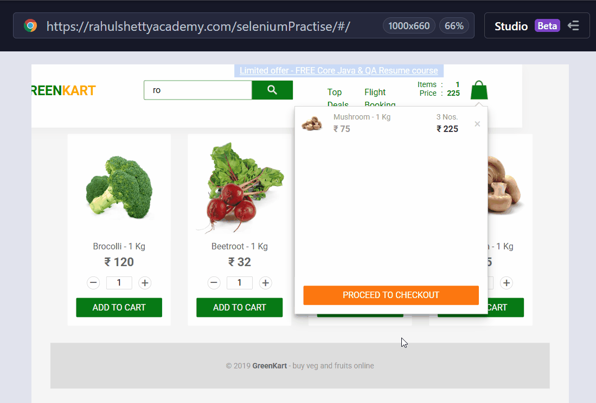

# KraSStaS_GREENKART-Cypress

[](https://www.cypress.io/)
[](https://developer.mozilla.org/en-US/docs/Web/JavaScript)
[](https://nodejs.org/)
[](https://github.com/krasstas/KraSStaS_GREENKART-Cypress)
[](#)
[](#)

Automated UI testing project for the GreenKart demo application using Cypress.

---

### 📌 Project Description

This repository contains an automated test completed as part of a technical assignment  
for testing the web application:

👉 https://rahulshettyacademy.com/seleniumPractise/#/

The goal of the task was to:

- Filter products using a search input
- Add specific items (Carrot and Mushroom) to the cart
- Modify product quantities
- Remove one selected product from the cart
- Store selectors in a structured file (constants / locators)
- Follow Cypress best practices (clear test structure, assertions, reusable selectors)

---

## 🎯 Project Goals

The purpose of this project is to demonstrate practical skills in:

- Creating automated UI tests using Cypress
- Designing stable and readable locators
- Applying PageObject principles in a lightweight form
- Implementing assertions for verification of functionality
- Structuring a clear and scalable test project
- Using Git and GitHub for version control and project hosting
- Preparing professional QA documentation (README, project structure)

This project simulates a real-life automation task and reflects common workflows used in QA automation teams.

---

## ✅ Tech Stack

- **JavaScript**
- **Cypress 15+**
- **Node.js**
- **Git / GitHub**
- **VS Code**

---

## 📦 Dependencies

All dependencies are managed via `package.json` and installed automatically with `npm install`.

Main dependencies:

- Cypress ^15.6.0
- Node.js 22+
- JavaScript (ES6)

---

## ✅ Project Structure

```plaintext
KraSStaS_GREENKART-Cypress/
│
├── cypress/
│   ├── e2e/
│   │   ├── greenkart_krasstas_Custom_spec.cy.js   # Main automated test
│   │   └── greenkart_krasstas_Record_spec.cy.js   # Studio auto-record test (not used)
│   │
│   ├── pageobjects/
│   │   └── selectors.cy.js                        # Centralized locators/constants
│   │
│   ├── fixtures/                                  # Default Cypress folder
│   ├── screenshots/                               # Auto screenshots (ignored)
│   └── videos/                                    # Auto videos (ignored)
│
├── .gitignore
├── README.md
├── cypress.config.js
├── package.json
└── package-lock.json
```

## ✅ Installation & Setup

### 1. Clone the repository

```bash
git clone https://github.com/krasstas/KraSStaS_GREENKART-Cypress.git
```

### 2. Navigate into the project folder

```bash
cd KraSStaS_GREENKART-Cypress
```

### 3. Install dependencies

```bash
npm install
```

## ✅ How to Run the Tests

### 1. Run in Interactive Mode (UI)

```bash
npx cypress open
```

### 2. Run in Headless Mode (terminal only)

```bash
npx cypress run
```

## ✅ Test Scenario Overview

The automated test performs the following actions:

1. Open the GreenKart application
2. Search products using keyword "ro"
3. Locate Carrot
4. Set quantity to 5
5. Add Carrot to cart
6. Locate Mushroom
7. Increase quantity by 2
8. Add Mushroom to cart
9. Open cart preview
10. Remove Carrot from the cart

---

## 🖼️ Screenshot



## 🎬 Demo (GIF)



## 🛠️ Future Improvements

- Add CI/CD integration (GitHub Actions)
- Parametrize test data
- Add negative test cases
- Add more PageObject structure
- Integrate reporting (Allure)

## ✅ Author

**Stanislav Krasilnikov (KraSStaS)**  
Automated QA Engineer

🔗 GitHub: https://github.com/krasstas
